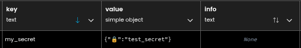
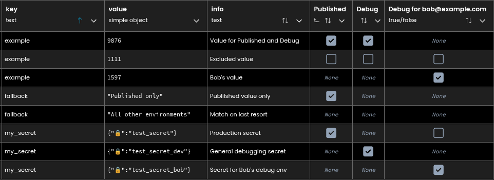
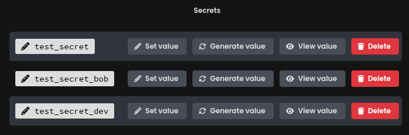
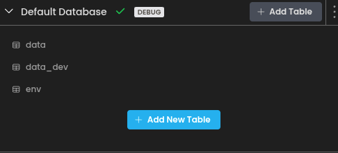
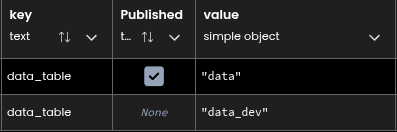

<p align="center">

</p>

ENV is a flexible environment variable handler that is designed to be compatible with dependency apps.


# Basic Usage
You can use ENV as a way to give flexibility to configuration variable without having to chase down where they live in the code base.
```
from ENV import environ

my_variable = environ.get('MY_VARIABLE', defalut=1234)
print(my_variable) -> 1234
```
This can be done without any setup other than adding ENV as a dependency.  However, by adding this type of default get to your code you can then ask about what variables are being used in the codebase from the sever console by running:
```
>>> from ENV import environ
>>> environ.VARIABLES

Environment Variables
in_use:
	No variables in use.
available:
	MY_VARIABLE
```

We can see that `my_variable` is available to override and that we currently do not have any variables in use.

# Setup
Create a table called `env` with columns:
* `key` of type `str`
* `value` of type `simple object`
* `info` of type `str`

You can check the setup status in the server console by running:
```python-repl
>>> environ.DB
ENV Table Status: Ready
  'env' table created
  key, value, info columns found
```
or information on what setup still needs to happen.

# Usage
After a table is setup in the parent app we get expanded functionality.

## Overriding default values
The default values of can be overridden by adding a record in the `env` table.  For instance, to override the `MY_VARIABLE` from earlier we can add the record:


`key=MY_VARIABLE, value=9876, info=this is just a test variable to demonstrate ENV usage`

To the `env` table.

Afterward, when we run the same code block:
```python
from ENV import environ
my_variable = environ.get('MY_VARIABLE', default=1234)
print(my_variable) -> 9876
```
We get the overridden value from the table rather than the default.

## Forced Variables
We can force values to be used in the `env` table by no providing any default value when using `get`.  If the value is not setup within the `env` table we will get a `LookupError`.

```python-repl
>>> from ENV import environ
>>> url = environ.get('APP_URL')
LookupError: environment variable: 'APP_URL' not found
```

After adding the record to the table:
```python-repl
>>> environ.get('APP_URL')
example.com
```

## Referencing App Secrets
Direct access to App Secrets is possible using ENV.

To reference a secret in the `env` table wrap the App Secret name:
```python
from ENV import environ

environ.set('my_secret', environ.Secret('test_secret'))
```

This will create an entry in the `env` table:


The secret is a simple dict with unicode character `🔒` `U1F512` as the key and the name
of the app secret as the value.
I wanted something that struct the right balance between easy to enter manually in the
table but would not restrict possible table values.

You can easily grab this character from the server console
```pyton-repl
>>> from ENV import environ
>>> environ.Secret.SIGNATURE
'🔒'
```

Now that we have a reference to an App Secret, we can access it like any other variable.
```python
from ENV import environ
secret = environ.get('my_secret')
print(secret) -> 42
```

Secrets are not cached and are accessed at point of use only so there should be no security
difference between getting a secret using `ENV` or using `anvil.secrets.get_secret`


# Environment Specific Variables
There is full support for automatic selection of variables based on which environment the code is currently executing in.  The environment can be found by looking at the information in `anvil.app.envronment`.  More information about environments can be found in anvil's documentation [Environments and Code](https://anvil.works/docs/deployment-new-ide/environments-and-code#getting-the-current-environment).  The environments are determined by looking at the `environment.name` field.  Common environment names are:
* Published
* Production
* Staging
* Debug
  * Debug for user@example.com

Any `env` table column that is a type `bool` will be considered an environment identifier column.

## Environment matching
The process for resolving the current environment name with those in the `env` table is as follow:
1. Find an exact match
2. Find an environment in the table that is a `.startswith()` match 
   * example: 
     * environment.name = `Debug for bob@example.com`
     * table environment columns:
       * `Debug for abc@example.com`
       * `Debug`
     * Matches to `Debug`
   * This also means that you could have a column `P` that would match both `Published` and `Production`
3. Check for a generic row which has **all** environments set to None.
   

Debug environments support global values for all users by specifying creating a 
`Debug` column in the `env` table.  This will match to all Debug environments.  
However, you can create user specific values by adding their full Debug environment 
name as a column to the `env` table.


## Example Environment Specific Variables



With the table above here is how different environments would resolve the same variables.
```python-repl
environment.name: 'Published'
  environ.get('example') -> 9876
  environ.get('fallback') -> Published only
  environ.get('my_secret') -> 42
 
environment.name: 'Debug for abc@example.com'
  environ.get('example') -> 9876
  environ.get('fallback') -> All other environments
  environ.get('my_secret') -> not_42
 
environment.name: 'Debug for bob@example.com'
  environ.get('example') -> 1597
  environ.get('fallback') -> All other environments
  environ.get('my_secret') -> -42
 
environment.name: 'Staging'
  environ.get('example') -> raises LookupError: env: example not found in 'env' and no default value given.
  environ.get('example', default=1234) -> 1234
  environ.get('fallback') -> All other environments
  environ.get('my_secret') -> raises LookupError: env: my_secret not found in 'env' and no default value given.
  environ.get('my_secret', default=1234) -> 1234
```

**Things to note:**
1. The all `False` `example` row did not default match
2. The all `None` `fallback` row does match as a default
3. When no match is found and no default is given a LookupError is raised
4. When no match is found and a default is given, the default is returned.


## Automatic Environment Specific Tables
It is easy to have database tables that are specific to environments by simply 
adding entries for the table names:



You can then access the tables using the table name:
```python
from ENV import environ

data_table = app_tables[environ.get('data_table')]

@anvil.server.callable
def get_data():
    return data_table.search()
```


# ENV in Uplink
Along with being able to use the ENV as a third party dependency in your Anvil app,
you can also install ENV from the github repo.  
For example, to add the current `ENV` version to your `requirements.txt`:
```requirements
ENV @ git+https://github.com/racersmith/anvil_env.git@master
```

ENV will work just like it does on the app side. The only thing to keep in mind is that


# Variable Tracking
Variables are automatically tracked throughout the code whenever their value is set or retrieved.  This can be helpful for understanding what is available and in use without having to dig through dependency apps or find configuration variables.  This can be done from the server console:
```python-repl
>>> from ENV import environ
>>> environ.VARIABLES
>>> environ.VARIABLES
Environment Variables
in_use:
	APP_URL
available:
	MY_VARIABLE
```

You can also query the names directly:
```python-repl
environ.VARIABLES.in_use
environ.VARIABLES.available
environ.VARIABLES.all
```

## Tracking
Tracking is done whenever the value is set or retrieved.  
So variables can only be tracked if the code has been executed.

ServerModule
```python
from ENV import environ

app_url = environ.get('APP_URL')
if False:
    my_var = environ.get('MY_VARIABLE', 1234)
```
now from the console:
```python-repl
>>> from ENV import environ
>>> environ.VARIABLES
environ.VARIABLES
Environment Variables
in_use:
	APP_URL
available:
	No variables available
```
You will get no mention of `MY_VARIABLE` because the code was not executed.  
You could use this as a feature by helping find unused variables or a bug if misunderstood.

## Detailed Variable Info
You can request detailed information about the registered variables.  The detailed view
shows the value found in the table as well as the default given during `.get()`. 

To put a layer between App Secret references, their values are not shown in the detailed view, rather their pointer is shown.
```python-repl
>>> environ.VARIABLES.detailed
Environment Variables
in_use:
	fallback=All other environments, default=NotSet, in_use=True
	example=9876, default=NotSet, in_use=True
	my_secret=🔒test_secret_dev, default=NotSet, in_use=True
available:
	new_variable=NotSet, default=1234, in_use=False
```

# Testing
I'm utilizing [anvil_testing](https://github.com/racersmith/anvil_testing):`CCW3SYLSAQHLCF2A` as a dependency for running tests.
From a published **debug** URL you can run the tests by going to the `/test` route.
You will also see the test url in the server console on startup.  For a non-cloned version the tests
can be run here [https://afkpypdljmh2tyvk.anvil.app/JXQD55XPRBEGPGY7SJIY2BKJ/test](https://afkpypdljmh2tyvk.anvil.app/JXQD55XPRBEGPGY7SJIY2BKJ/test)

If you don't want to use this dependency, just clone and delete the `_testing/` folder.